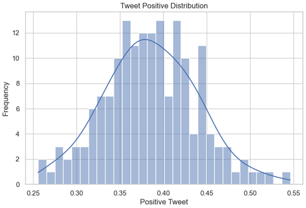
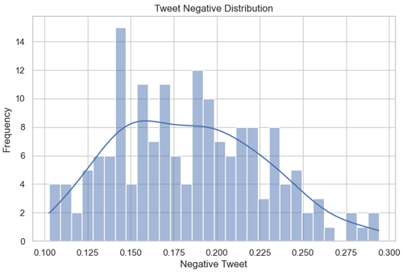
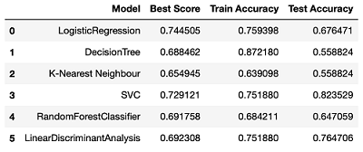

# Is the up & down of stock price affected by user sentiment and macro economics? Can we predict stock with this information?

## Summary 

In this project, I perform some analysis to see if the up & down of stock price is affected by user sentiment and macro economics data. I pick a single stock Tesla (TSLA) for the purpose of my analysis.

## Source of Data

There are three different data sources that are used in this analysis:
1. Stock price\
Source:  https://www.kaggle.com/datasets/equinxx/stock-tweets-for-sentiment-analysis-and-prediction\

2. Twitter feed for user sentiment\
Source: https://www.kaggle.com/datasets/equinxx/stock-tweets-for-sentiment-analysis-and-prediction\

3. Macro Economics data\
Source: https://www.kaggle.com/datasets/sarthmirashi07/us-macroeconomic-data

## Data Preparation & Clean-up

Each dataset from these three datasets contains different date range, so in order to combine all three into one, we need to use data that is intersect in all three datasets.
- Stock dataset contains data from 2021-09-30 to 2022-09-29
- Macro Economics dataset contains data from 1980-11-01 to 2022-05-01
- Twitter dataset contains data from 2021-09-30 to 2022-09-29

The available data range that is available from these three datasets: 10/1/2021 - 5/31/2022. So each dataset will be filtered within this date range.

Besides that, there are some filtering and data clean-up that are done:
- Stock data:
  - Filter by CompanyName='TSLA'
  - Remove column 'close' and rename column 'Adj Close' to 'value' and make the rest of columns lower case.
  - Add a new column 'target' and populate with value of 1 (means stock value go up from previous day) or 0 (means stock value go down from previous day)
- Macro economics: 
  - Drop un-needed columns, rename some of columns and make it lower case
  - Since the data is monthly and need to be joined with other dataset, then the data needs to duplicate into daily data for the same month
- Twitter: 
   - Rename some of columns and make it lower case
   - Clean-up some un-wanted character or text in the tweets.
   - Add new columns for user sentiment: positive, negative, and neutral.\
     To generate user sentiments, I tried SentimentIntensityAnalyzer from NTLK library and also Roberta Pretrained Model. I ended up using the Roberta since the result of sentiments looks more accurrate, here is the example:
      

## Examining Data

After doing data clean-up and combining all three datasets, the final dataset look like the following:

Here is how the Tesla stock price look like with the distribution of up & down of the stock for the period of 10/1/2021 - 5/31/2022.

### Data Distribution

We have a pretty close number of distribution of 'target' data (up & down of the stock value)

The next four charts show distribution of tweet positive, neutral, negative, and also polarity score.

### User Sentiment Data

The following scatter plot shows the user sentiment of positive & negative tweets with respect to target (1=Up=Yellow, 0=Down=Purple)

The next two plots shows the positive and negative sentiments differentiated by the stock up & down value. 

Notice in the positive sentiment, the green (up or positive) line is mostly higher or above the red (down or negative) line, which means when sentiment is positive, stock value is up

Likewise, in the negative sentiment, the red (down or negative) line is mostly higher or above the green (up or positive) line, which means when sentiment is negative, stock value is down

Let's look at the tweet score result; In this chart, we can see the score value of respective positive, negative, and neutral. Notice that the 'positive' is not that high and almost about the same score as 'neutral', this tells us that we may not have balance data and it will be great if we have stronger positive sentiment

Next is the tweet polarity score which should have values ranging from -1 to 1. Notice that not many data that has score below 0 because as describe in previous chart, the neutral sentiments are pretty high and it's better to have data where sentiments are more toward positive or negative and less on neutral.

## Analysis and Findings

In this analysis, I ran several classification algorithm such as Logistic Regression, Decision Tree, K-Nearest Neighbor, SVC, Random Forest, and Linear Discriminant Analysis. Here is the result after running all algorithms:

The accuracy scores are better than my initial report which was mostly below 60 but in this new report, the result mostly above 60 except for Decision Tree. The highest is the SVC algorithm followed by Linear Discriminant Analysis. 

I think there are still rooms to improve the current results and here are some conclusions based on my findings:
 
- As mentioned, the results in the current report are better than my previous results, one of the main reasons is I made a mistake in calculating the average of the sentiment results for several tweets for the same day. I fixed it in my latest notebook.
- In order to combine all datasets that include the Macro Economic data, I need to duplicate the Macro Economic data for the same month into daily data, this duplicate data may affect the accuracy result.
- I don't have enough data, I think I may need to collect more data perhaps using twitter API so I can more variety of sentiments data where it has higher positive and negative sentiments with lower neutral sentiment.
- There are still some rooms to fine tune the GridSearchCV parameters to get higher score specifically SVC that currently has the highest score.
- I can experiment with a different stock ticker to see if other tickers may be more sensitive and affected by user sentiments and macro economics data.
- In summary, the up & down of stock price in this analysis somewhat is affected by user sentiments as shown in several of my charts regarding user sentiments and there are several thing that we can do to improve as described in several previous bullet points.

## What's Next

I think with the combination usage of neural network algorithm, we may be able to predict future stock values instead of just predicting if it goes up or down.
