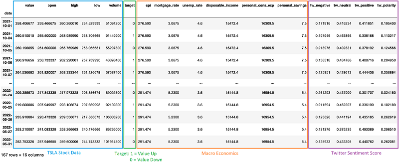
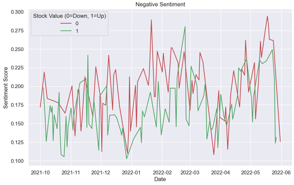

# Is the up & down of stock price affected by user sentiment and macro economics? Can we predict stock with this information?

## Summary 

In this project, I perform some analysis to see if the up & down of stock price is affected by user sentiment and macro economics data. I pick a single stock Tesla (TSLA) for the purpose of my analysis.

## Source of Data

There are three different data sources that are used in this analysis:
1. Stock price\
Source:  https://www.kaggle.com/datasets/equinxx/stock-tweets-for-sentiment-analysis-and-prediction\

2. Twitter feed for user sentiment\
Source: https://www.kaggle.com/datasets/equinxx/stock-tweets-for-sentiment-analysis-and-prediction\

3. Macro Economics data\
Source: https://www.kaggle.com/datasets/sarthmirashi07/us-macroeconomic-data

## Data Preparation & Clean-up

Each dataset from these three datasets contains different date range, so in order to combine all three into one, we need to use data that is intersect in all three datasets.
- Stock dataset contains data from 2021-09-30 to 2022-09-29
- Macro Economics dataset contains data from 1980-11-01 to 2022-05-01
- Twitter dataset contains data from 2021-09-30 to 2022-09-29

The available data range that is available from these three datasets: 10/1/2021 - 5/31/2022. So each dataset will be filtered within this date range.

Besides that, there are some filtering and data clean-up that are done:
- Stock data:
  - Filter by CompanyName='TSLA'
  - Remove all columns except 'Adj Close' and rename as 'value'
  - Add a new column 'is_positive' and populate with value of 1 (means stock value go up from previous day) or 0 (means stock value go down from previous day)
- Macro economics: 
  - Drop un-needed columns, rename some of columns and make it lower case
  - Since the data is monthly and need to be joined with other dataset, then the data needs to duplicate into daily data for the same month
- Twitter: 
   - Rename some of columns and make it lower case
   - Clean-up some un-wanted character or text in the tweets.
   - Add new columns for user sentiment: positive, negative, and neutral.\
     To generate user sentiments, I tried SentimentIntensityAnalyzer from NTLK library and also Roberta Pretrained Model. I ended up using the Roberta since the result of sentiments looks more accurrate, here is the example:
      

After doing data clean-up and combining all three datasets, the final dataset look like the following:

The Scatter plot that shows the user sentiment of tweet positive vs. negative

The Tesla stock price and the distribution of up & down of the stock for the period of 10/1/2021 - 5/31/2022.

The following shows the positive and negative sentiments differentiated by the stock up & down value.

## Analysis and Findings

In this analysis, I ran several classification algorithm such as Decision Tree, KNN, SVC, and Random Forest. Here is the result after running all algorithms:

The accuracy scores are pretty low (below 60) for all the algorithms, this may be due to several reasons:
- The positive and negative of tweet data distribution does not look good to me, I need to look into this more to understand what the issue here.
- When I look at the positive & negative sentiments that are differentiated by the up & down value (see chart above), I don't see the data looks good either, it may be due to the way I average the sentiment results for several tweets for the same day is not correct, I may need to look into this and use a different approach, so that I can intepret the data better in a chart.
- In order to combine all datasets that include the Macro Economic data, I need to duplicate the Macro Economic data for the same month into daily data, this duplicate data may also affect the accuracy result.
- I may need to fine tune and play around more with GridSearchCV parameters to see if I can improve the score.

For this initial findings, I think I need to do further analysis in order to figure out if the up & down of stock price is affected by user sentiment and macro economics.
